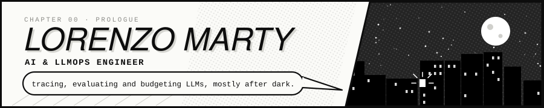
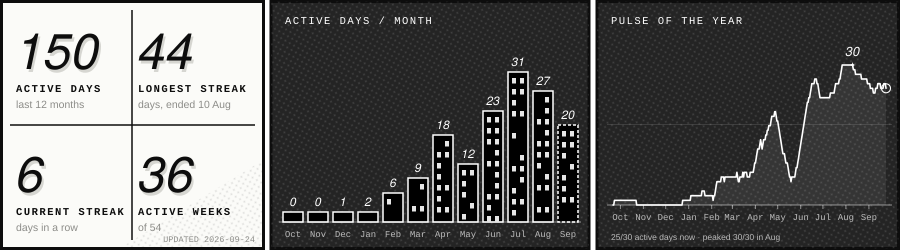
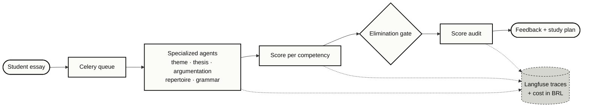

  Santa Maria, Brazil · Internet Systems student at UFSM · research fellow at a robotics company 
  
  

I'm a Python developer aiming at AI engineering, with one habit I can't shake: **I instrument everything.** An LLM feature that ships without a trace, a cost number and a way to check its answers isn't finished — it's a demo.

Since 2026 I've been a research fellow at a robotics company, building Python backend services for observability and telemetry plus a Next.js frontend on a design system. On my own time I ship products end to end, from schema to deploy. I do my best work at night; off the keyboard, it's anime and manga.

*My commit graph only shows part of the story: much of my work lives in private and organization repositories, in design docs and in decisions. So I keep a dated log, one entry per work session. Each building is a month, each star a day I logged. \* month to date.*

Every LLM feature gets a trace, a cost number and an audit step before it ships. The correction pipeline of [Donc](https://github.com/LorenzoMarty/Donc), my ENEM essay platform:

| | Arc | What it does | Stack |
|:-:|---|---|---|
| ● | [**Donc**](https://github.com/LorenzoMarty/Donc) · [app](https://app-redacao-five.vercel.app) | ENEM essay platform: pipeline of specialized LLM agents, RAG, gamified cognitive trainer | Next.js 16 · FastAPI · Postgres + pgvector · Celery · agno · OpenAI · Langfuse |
| ◐ | [**Agenda-Juri**](https://github.com/LorenzoMarty/Agenda-Juri) | Law-firm CRM: cases, deadlines, Google Calendar/Drive sync, AI meeting summaries | Django 6 · React 19 · Celery · Redis · Docker · GCP |
| ○ | [**Oráculo Chatbot**](https://github.com/LorenzoMarty/Oraculo-Chatbot) | RAG chatbot over documents, websites and videos | Django · Agno · Qdrant |
| ○ | [**Transcripty**](https://github.com/LorenzoMarty/Transcripty) | Meeting recorder with transcription and automated summaries | Python · Streamlit · Whisper · LLM |
| ⊘ | **NexaFit** | Fitness PWA: workout logging and body-evolution charts | Next.js 16 · Drizzle · Neon · Tailwind 4 |
| ◌ | **RastroAI** | Investigative intelligence on Brazilian open public data | Python · Postgres · Neo4j |

*● live · ◐ client work · ○ public · ⊘ private · ◌ in design*

            

**Focus:** LLM applications and agents · RAG · observability (OpenTelemetry, Prometheus, Grafana, Langfuse) · async pipelines · API design

| Now | Next arc | Endgame |
|---|---|---|
| Building Donc and the data foundation for RastroAI | Evaluation, tracing and cost control for LLM apps, in production | AI and data engineer at mid-level: reliable LLM systems, measured end to end |

<b><i>To be continued…</i></b>

